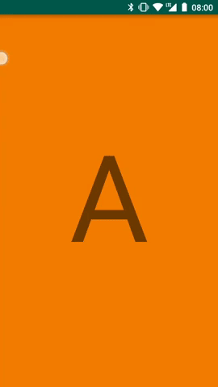

# A | B

<p align="center">
	
</p>

Самая интересная часть логики находится в [MainActivity.kt...](https://github.com/andreylitvintsev/A-B/blob/master/app/src/main/java/com/github/andreylitvintsev/transitionbetweenfragments/MainActivity.kt)

```kotlin
private fun openFragmentWithAnimation(fragmentIndex: Int) {
        val currentFragment = supportFragmentManager.findFragmentById(R.id.fragmentContainer) as PlayerFragment

        FragmentComposer(supportFragmentManager)
            .setTargetFragment(currentFragment)
            .animate { view, _ ->
                return@animate AnimatorInflater.loadAnimator(this, R.animator.move_to_back).apply {
                    setTarget(view)
                }
            }
            .add(R.id.fragmentContainer, fragments[fragmentIndex])
            .waitForViewLayoutChanged()
            .transform { view, baseFragment ->
                (view as SupportedFractionFrameLayout).yFraction = 1f
            }
            .waitForFragmentResume()
            .animate { view, _ ->
                return@animate AnimatorInflater.loadAnimator(this, R.animator.show_up).apply {
                    setTarget(view)
                }
            }
            .remove(currentFragment)
            .notify {
                canClick = true
            }
            .letsGo()
    }
```
